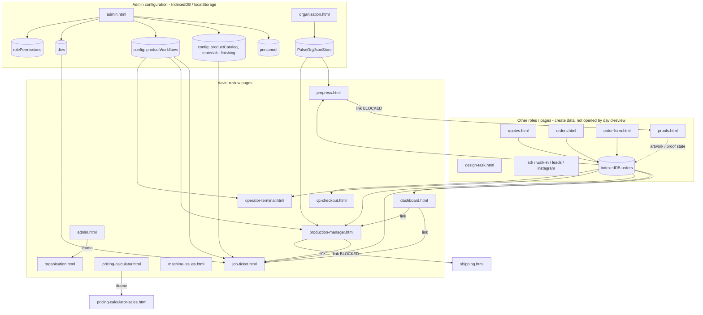

# Davit / David Review — Scope, Dependencies & Deletion Plan

**Status:** Applied on branch 2026-05-21 — production-focused nav, roles, and file cleanup completed.  
**Purpose:** Record findings from codebase review so the team can return later and remove parts of Pulse that this user does not use.  
**Last reviewed:** 2026-05-18  
**Storage mode assumed:** Local / IndexedDB (`PULSE_STORAGE_BACKEND` = `indexeddb` or unset; Supabase not connected).

---

## 1. User identity in the codebase

| Item | Finding |
|------|---------|
| Name **“Davit”** | **Not found** anywhere in the repository (no personnel seed, no `auth.js` entry). |
| Closest match | **David Zargaryan** — role **`david-review`** (“David Review”) in `auth.js`. |
| Login sources | `LOCAL_EMAIL_USERS` (`david@bazaar-admin.com`), `EXTRA_AUTH_USERS`, and/or **Admin → Personnel** (IndexedDB) if added manually as “Davit” with role `david-review`. |
| Session | `sessionStorage` key `pulse_session` → `{ name, role, loginTime }`. |
| Home page after login | `dashboard.html` (`ROLE_HOME_PAGE['david-review']`). |

If Personnel lists **“Davit”** with role **`david-review`**, behavior matches this document. If the role differs, use `ROLE_CONFIG` for that role instead.

---

## 2. How the app works (local mode summary)

| Layer | Location | Role |
|-------|----------|------|
| UI pages | `*.html` at repo root | Each page calls `initAuth('page-id')` from `auth.js`. |
| Access control | `auth.js` → `ROLE_CONFIG`, `canAccessPage()`, `applyRoleAccess()` | Page IDs must match `ROLE_CONFIG[role].pages`. |
| Overrides | Admin → Roles → saved to IndexedDB `config.rolePermissions` + `localStorage` `pulse_role_overrides` | Can widen/narrow access per browser. |
| Data | `shared.js` → IndexedDB `BazaarPrintDB` | Orders, personnel, config, dies, inventory, etc. |
| Supabase | `supabase-client.js` | **No-op** when backend is not `supabase`. Safe to ignore for this user’s deployment. |
| Auth login | Name dropdown + User ID | Personnel DB is primary; fallbacks: `OPERATOR_PROFILES`, `EXTRA_AUTH_USERS`, `LOCAL_EMAIL_USERS`. |

**Important:** IndexedDB is **per browser**. Other staff may still create orders via pages this user never opens; those orders still appear on dashboard / job-ticket / prepress / etc.

---

## 3. Pages this user **uses** (`david-review` role)

Defined in `auth.js` → `ROLE_CONFIG['david-review']`.

| Page ID | HTML file | Primary purpose |
|---------|-----------|-----------------|
| `dashboard` | `dashboard.html` | Production board, kanban/table, links to tickets |
| `job-ticket` | `job-ticket.html` | Create/edit/view job tickets, queue, workflows on ticket |
| `pricing-calculator` | `pricing-calculator.html` | Shell; embeds calculator iframe |
| `prepress` | `prepress.html` | Prepress queue and actions on orders |
| `production-manager` | `production-manager.html` | Production queue, PM actions |
| `operator-terminal` | `operator-terminal.html` | Floor operator UI, workflow steps |
| `qc-checkout` | `qc-checkout.html` | QC pass/fail, status → `ready-to-ship` |
| `machine-issues` | `machine-issues.html` | Machine issue log (localStorage) |
| `organisation` | `organisation.html` | Company / facilities / hardware (also standalone nav) |
| `admin` | `admin.html` | Admin console (subset of tabs only) |

### 3.1 Embedded / child UI (keep with parent)

| Parent | Child / dependency | Notes |
|--------|-------------------|--------|
| `pricing-calculator.html` | `pricing-calculator-sales.html` | Loaded in iframe; edit calculator in sales file. |
| `admin.html` (Organisation tab) | `organisation.html?embedded=admin` | iframe; same org data as standalone organisation page. |

### 3.2 Admin tabs this user **can** use

`adminTabs` in `auth.js`:

- `personnel`
- `machines`
- `dies`
- `organisation` (iframe)
- `products`
- `product-workflows`
- `roles`

### 3.3 Admin tabs this user **cannot** use (hidden by `applyRoleAccess`)

- `inventory`
- `purchase-orders`
- `knowledge`
- `qa-rules`
- `settings`

Data from Settings (e.g. `defaultFacility`, `machineCapacity`) may still exist in IndexedDB if another admin configured it; production pages use code defaults if missing.

### 3.4 Permission flags

| Flag | Value | Effect |
|------|-------|--------|
| `canViewAdmin` | true | Admin nav + submenu |
| `canViewProduction` | true | Prepress, Production, QC, Report Issue nav group |
| `canViewOperator` | true | Operator Terminal nav |
| `canEditAllTickets` | false | Not full ticket editor like admin/supervisor (`canEditTicket()` returns false unless `ownTicketsOnly` — not set for this role). `applyTicketEditLock()` exists in `auth.js` but is **not wired** from `job-ticket.html` at time of review. |

---

## 4. Pages in nav but **blocked** for this role

These exist in `renderNav()` (`shared.js`) but are **not** in `david-review.pages`. Direct URL → **Access Restricted** (unless Roles matrix override was saved).

| Page ID | HTML file | Category |
|---------|-----------|----------|
| `quotes` | `quotes.html` | Sales |
| `orders` | `orders.html` | Sales / order list |
| `invoices` | `invoice.html` | Finance |
| `shipping` | `shipping.html` | Fulfillment |
| `application-dept` | `application-dept.html` | Production (other dept) |
| `jm-dashboard` | `jm-dashboard.html` | Job manager |
| `rep-tasks` | `rep-tasks.html` | Sales ops |
| `leads` | `leads.html` | CRM |
| `sdr-dashboard` | `sdr-dashboard.html` | SDR |
| `sdr-pipeline-portal` | `sdr-pipeline-portal.html` | SDR |
| `walkin-dashboard` | `walkin-dashboard.html` | Front desk |
| `proofs` | `proofs.html` | Design / proofs |
| `design-task` | `design-task.html` | Design |
| `instagram-leads` | `instagram-leads.html` | Marketing |
| `ops-manager` | `ops-manager.html` | Ops overview |
| `sales-dashboard` | `sales-dashboard.html` | Sales (not in main nav list but in other roles) |

Also blocked: `order-form.html`, `customer-detail.html`, competitor pricing pages, `reports.html`, customer portal, etc. (no `david-review` entry in `ROLE_CONFIG`).

---

## 5. Page dependencies

### 5.1 Architecture diagram



### 5.2 Internal links (allowed cluster)

| From | To | Type |
|------|-----|------|
| `dashboard.html` | `job-ticket.html`, `production-manager.html` | `<a href>` with `?order=` |
| `production-manager.html` | `job-ticket.html` | Edit ticket, new job |
| `job-ticket.html` | `job-ticket.html` | Sub-tickets, queue navigation |
| `admin.html` | `organisation.html` | iframe `?embedded=admin` |
| `pricing-calculator.html` | `pricing-calculator-sales.html` | iframe |

### 5.3 Outbound links to **blocked** pages (gaps if deleting nothing)

| From | Target | Risk |
|------|--------|------|
| `production-manager.html` | `shipping.html?packingSlip=…` | User cannot open packing slip UI |
| `prepress.html` | `proofs.html` | User cannot open proof locker; may still work from files on order |

### 5.4 Order status pipeline (shared data, not separate pages)

Typical flow across allowed pages:

`queued-in-dashboard` → `prepress` / `prepress-active` / `prepress-paused` → `in-production` → `qc-checkout` → `ready-to-ship` → *(shipping)* → `shipped`

david-review can run steps through **QC → ready-to-ship** but does **not** have `shipping` page access.

### 5.5 Data dependencies (not HTML navigation)

| Data / config | Set in | Consumed by |
|---------------|--------|-------------|
| `orders` | Many pages (mostly **not** in david-review list) | dashboard, job-ticket, prepress, PM, operator, QC |
| `productCatalog`, catalog * modes | Admin → Products | job-ticket |
| `productWorkflows` | Admin → Product Workflow Configuration | job-ticket, PM, operator (`resolveProductWorkflowSteps`) |
| `personnel` | Admin → Personnel | Login dropdown |
| `dies` | Admin → Dies | job-ticket (die-related fields) |
| `MACHINES`, `FACILITIES` | `shared.js` (+ org bundle) | PM, operator, machine-issues (hardcoded machine names in issues UI) |
| `pulse_machine_issues` | `machine-issues.html` only | localStorage — independent |
| `rolePermissions` | Admin → Roles | All pages via `auth.js` overrides |

### 5.6 Supabase-only features (inactive in local mode)

| Feature | Page | Local behavior |
|---------|------|----------------|
| V3 `production_tasks` queue | `prepress.html` | Hidden / empty if no Supabase client |
| Prepress proof-linked tasks | `prepress.html` | Same |
| Organisation cloud tables | `organisation.html` | Uses `PulseOrgJsonStore` / local JSON |

---

## 6. Core files — **do not delete** for david-review deployment

These are required regardless of which HTML pages remain:

| File | Reason |
|------|--------|
| `shared.js` | IndexedDB, orders CRUD, workflows, machines, UI helpers, `renderNav`, seed personnel |
| `auth.js` | Login, `ROLE_CONFIG`, `initAuth`, access checks |
| `organisation-local-store.js` | Organisation local JSON (`PulseOrgJsonStore`) |
| `pulse-config.local.js` | Optional; keep example or minimal indexeddb config |
| `supabase-client.js` | Can stay (no-op locally) or remove only if all references removed |
| `pulse-logo.png`, `branding/` | UI branding |
| `index.html` | Redirect to dashboard |
| All **10** primary HTML pages in §3 + `pricing-calculator-sales.html` | User-facing app |

---

## 7. Deletion inventory

Legend:

- **KEEP** — Required for david-review as currently defined.
- **KEEP (embedded)** — Required as child of a KEEP page.
- **KEEP (data upstream)** — User does not open it, but **orders/data** may be created here by others; delete only if this deployment will **never** use sales/SDR flows and orders are created only via job-ticket.
- **DELETE CANDIDATE** — Not in role access; safe to target for removal in a **Davit-only slim build** after confirmation.
- **UTILITY** — Dev/migration tools; not part of daily use.
- **LEGACY** — Old duplicate tree; candidate for removal if v3 root pages are canonical.

### 7.1 Primary app pages (repo root)

| File | Verdict | Notes |
|------|---------|-------|
| `dashboard.html` | **KEEP** | |
| `job-ticket.html` | **KEEP** | Hub for tickets |
| `pricing-calculator.html` | **KEEP** | |
| `pricing-calculator-sales.html` | **KEEP (embedded)** | |
| `prepress.html` | **KEEP** | |
| `production-manager.html` | **KEEP** | Trim shipping links if removing `shipping.html` |
| `operator-terminal.html` | **KEEP** | |
| `qc-checkout.html` | **KEEP** | |
| `machine-issues.html` | **KEEP** | |
| `organisation.html` | **KEEP** | |
| `admin.html` | **KEEP** | Consider removing unused tab markup later |
| `quotes.html` | **DELETE CANDIDATE** | Sales |
| `orders.html` | **DELETE CANDIDATE** | Sales; orders may still be needed via job-ticket only |
| `order-form.html` | **DELETE CANDIDATE** | |
| `invoice.html` | **DELETE CANDIDATE** | |
| `shipping.html` | **DELETE CANDIDATE** | Unless packing slip link fixed or role gains `shipping` |
| `application-dept.html` | **DELETE CANDIDATE** | |
| `sales-dashboard.html` | **DELETE CANDIDATE** | |
| `jm-dashboard.html` | **DELETE CANDIDATE** | |
| `rep-tasks.html` | **DELETE CANDIDATE** | |
| `leads.html` | **DELETE CANDIDATE** | |
| `sdr-dashboard.html` | **DELETE CANDIDATE** | |
| `sdr-pipeline-portal.html` | **DELETE CANDIDATE** | |
| `walkin-dashboard.html` | **DELETE CANDIDATE** | |
| `proofs.html` | **DELETE CANDIDATE** | Prepress links break; fix links first |
| `proof-approve.html` | **DELETE CANDIDATE** | |
| `design-task.html` | **DELETE CANDIDATE** | |
| `instagram-leads.html` | **DELETE CANDIDATE** | |
| `ops-manager.html` | **DELETE CANDIDATE** | |
| `reports.html` | **DELETE CANDIDATE** | |
| `quote-print.html` | **DELETE CANDIDATE** | |
| `competitor-pricing.html` | **DELETE CANDIDATE** | |
| `competitor-pricing-datacenter.html` | **DELETE CANDIDATE** | |
| `competitor-pricing-lookup.html` | **DELETE CANDIDATE** | |
| `competitor-price-calculator.html` | **DELETE CANDIDATE** | |
| `customer-portal.html` | **DELETE CANDIDATE** | External customer-facing |
| `customer-portal-login.html` | **DELETE CANDIDATE** | |
| `customer-detail.html` | **DELETE CANDIDATE** | |
| `admin-next.html` | **DELETE CANDIDATE** | Separate experimental admin OS |
| `index.html` | **KEEP** | Entry redirect |

### 7.2 Utilities & migration (repo root)

| File | Verdict | Notes |
|------|---------|-------|
| `reset-pulse-local-data.html` | **UTILITY** | Keep for support or delete in production deploy |
| `migrate-to-supabase.html` | **UTILITY** | Not needed if staying on IndexedDB |
| `proxy.js` | **UTILITY** | SMS/proxy; check if prepress SMS used locally |
| `r2-client.js` | **UTILITY / DELETE CANDIDATE** | Cloud artwork; local may not need |
| `instagram-config.json` | **DELETE CANDIDATE** | With instagram-leads |

### 7.3 `v2/` duplicate pages

| Path | Verdict |
|------|---------|
| `v2/shared.js` | **LEGACY — DELETE CANDIDATE** if root `shared.js` is canonical |
| `v2/admin.html`, `v2/dashboard.html`, `v2/job-ticket.html`, `v2/production-manager.html`, `v2/qc-checkout.html`, `v2/operator-terminal.html` | **LEGACY — DELETE CANDIDATE** |

### 7.4 `scripts/` and capture artifacts

| Area | Verdict |
|------|---------|
| `scripts/capture-*.js` | **DELETE CANDIDATE** for production deploy (competitor scraping) |
| `capture-*.js` (repo root) | **DELETE CANDIDATE** |
| `data/capture-*.json`, `data/competitor-*.json` | **DELETE CANDIDATE** |
| `node_modules/`, `package.json` (Playwright) | **DELETE CANDIDATE** if no automated tests needed in this fork |

### 7.5 Supabase (entire folder)

| Path | Verdict | Notes |
|------|---------|-------|
| `supabase/migrations/*.sql` | **DELETE CANDIDATE** | Only if **never** connecting Supabase |
| `supabase/SCHEMA.md` | **DELETE CANDIDATE** or archive | |
| `supabase-client.js` | **Optional KEEP** | Harmless no-op locally |

**Warning:** Deleting migrations does not affect local IndexedDB but removes upgrade path for cloud.

### 7.6 Documentation & spec files

| File | Verdict |
|------|---------|
| `DAVIT-SCOPE-DELETION-PLAN.md` | **KEEP** (this file) |
| `Description`, `FULL-SPEC.md`, `WORKFLOW-SPEC.md`, `PRODUCT-WORKFLOW-CONFIG.md` | **KEEP** for team reference |
| `COMPETITOR-PRICING-NOTES.md`, `BLOCKER-PATTERNS-*.md` | **DELETE CANDIDATE** with competitor tools |

### 7.7 `auth.js` cleanup (later, not now)

When deleting pages, also plan to remove from:

- `ROLE_CONFIG` entries for **other roles** (only if this fork is **single-user**).
- `renderNav()` page list in `shared.js` — remove dead links.
- `ROLE_HOME_PAGE`, `LOCAL_EMAIL_USERS`, `EXTRA_AUTH_USERS` — drop unused accounts.
- Admin HTML — remove unused tab panes for inventory, PO, knowledge, QA, settings **only if** no role needs them.

For a **multi-role** shop, keep other roles’ config and only delete HTML files that **no role** uses.

---

## 8. What we can delete vs what we should not (summary)

### 8.1 Safe to target for a **Davit-only** slim deployment

- All sales/CRM/SDR HTML pages (§7.1 DELETE CANDIDATE).
- Customer portal, competitor pricing suite, `admin-next.html`.
- `v2/` tree, capture scripts, competitor `data/` JSON.
- Supabase folder (if permanently local-only).
- Nav entries and role definitions for removed pages (follow-up code change).

### 8.2 Do **not** delete without replacement

| Item | Why |
|------|-----|
| `shared.js` | Entire app data layer |
| `auth.js` | Login and gates |
| `job-ticket.html` + Admin products/workflows | Ticket + routing |
| IndexedDB `orders` store | All production pages read it |
| `pricing-calculator-sales.html` | Parent iframe |
| `organisation-local-store.js` + org JSON seed | Facilities/branding |
| Personnel / roles in Admin | Login and access |

### 8.3 Delete only after a product decision

| Item | Decision needed |
|------|-----------------|
| `shipping.html` | Add `shipping` to david-review **or** remove PM packing-slip links |
| `proofs.html` | Add `proofs` to role **or** remove prepress “View in Proofs” links |
| `orders.html` / `quotes.html` | Will anyone still enter orders only via job-ticket? |
| Other roles (`admin`, `operator`, `account-manager`, …) | Is this fork **only** for Davit, or shared install? |

---

## 9. Recommended order of work (when you return)

1. Confirm identity: Personnel name **Davit** vs **David Zargaryan** and role `david-review`.
2. Export IndexedDB / document `rolePermissions` overrides on target machines.
3. Fix or accept blocked links (shipping, proofs) before deleting those files.
4. Decide: **single-user fork** vs **shared Pulse** (drives whether other roles stay in `auth.js`).
5. Remove DELETE CANDIDATE HTML + dead nav + unused scripts.
6. Smoke-test: login → dashboard → job-ticket → prepress → PM → operator → QC → admin tabs → organisation → pricing calculator → machine-issues.
7. Trim `shared.js` only where functions are provably unused (high risk — do last).

---

## 10. Reference — `david-review` in `auth.js` (source of truth)

```javascript
'david-review': {
  label: 'David Review',
  color: '#2563eb',
  pages: [
    'dashboard', 'job-ticket', 'pricing-calculator', 'prepress',
    'production-manager', 'operator-terminal', 'qc-checkout',
    'machine-issues', 'organisation', 'admin'
  ],
  canEditAllTickets: false,
  canViewAdmin: true,
  canViewProduction: true,
  canViewOperator: true,
  adminTabs: [
    'personnel', 'machines', 'dies', 'organisation',
    'products', 'product-workflows', 'roles'
  ],
},
```

---

## 11. Change log for this document

| Date | Change |
|------|--------|
| 2026-05-18 | Initial version from codebase review (local mode, david-review role, dependencies, deletion candidates). No application code modified. |
| 2026-05-21 | Cleanup executed: trimmed nav/roles, deleted sales/CRM/competitor/v2 pages, kept Pricing + Admin Payment/Quote. |

---

*End of planning document. Revisit before any deletion PR.*
