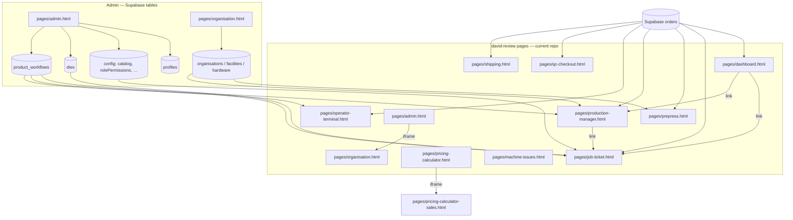

# Davit / David Review — Scope, Dependencies & Deletion Plan

**Status:** Applied on branch 2026-05-21 — production-focused nav, roles, and file cleanup completed.  
**Purpose:** Record findings from codebase review so the team can return later and remove parts of Pulse that this user does not use.  
**Last reviewed:** 2026-06-09  
**Current runtime:** Production uses **Supabase** + **email/password login** + **`pages/` / `js/` layout**. For how the app works today, read [`overview.md`](../app/overview.md) and [`production-status.md`](../supabase/production-status.md) first. Sections below marked *legacy* describe IndexedDB dev mode or pages that **no longer exist** in the repo.

---

## 1. User identity in the codebase

| Item | Finding |
|------|---------|
| Name **“Davit”** | **Not found** anywhere in the repository (no personnel seed, no `auth.js` entry). |
| Closest match | **David Zargaryan** — role **`david-review`** (“David Review”) in `auth.js`. |
| Login | **Email + password** (Supabase Auth). David's account: migration **047b** (`david@bazaar-admin.com`). Provisioned via Admin → Personnel + RPC **`upsert_pulse_personnel`** (migrations **046**, **049** — duplicate login email rejected on add). |
| Session | `sessionStorage` key `pulse_session` → `{ name, role, loginTime }`. |
| Home page after login | `/pages/dashboard.html` (`ROLE_HOME_PAGE['david-review']` via `pulsePage()`). |

If Personnel lists **“Davit”** with role **`david-review`**, behavior matches this document. If the role differs, use `ROLE_CONFIG` for that role instead.

---

## 2. How the app works today (production)

| Layer | Location | Role |
|-------|----------|------|
| UI pages | **`pages/*.html`** | Each page calls `initAuth('page-id')` from `js/auth.js`. |
| Shared logic | **`js/shared.js`** | Nav, theme, helpers, `onDBUpdate()` Realtime bridge. |
| Data (production) | **`js/supabase-client.js`** | All business CRUD → Supabase Postgres; Realtime subscriptions. |
| Access control | **`js/auth.js`** → `ROLE_CONFIG`, `canAccessPage()` | Page IDs must match `ROLE_CONFIG[role].pages`. |
| Overrides | Admin → Roles → **`config.rolePermissions`** in Supabase | `_applyRoleOverrides()` on every page load. |
| Config | **`js/pulse-config.js`** | `PULSE_STORAGE_BACKEND = 'supabase'` (production). |
| Auth login | **Email + password** | Supabase Auth + **`profiles`** table; RLS enforces role. |

**Important:** All authorized users share **one Supabase database**. Orders created on any page appear on dashboard / job-ticket / prepress for everyone with access.

### 2.1 Legacy IndexedDB dev mode (*not production*)

When `PULSE_STORAGE_BACKEND = 'indexeddb'`, data lives in browser **`BazaarPrintDB`**, login may use Name + User ID with hardcoded fallbacks, and overrides cache to `localStorage`. This mode is for offline dev only.

---

## 3. Pages this user **uses** (`david-review` role)

Defined in `js/auth.js` → `ROLE_CONFIG['david-review']`.

| Page ID | HTML file | Primary purpose |
|---------|-----------|-----------------|
| `dashboard` | `pages/dashboard.html` | Production board, kanban/table, links to tickets |
| `job-ticket` | `pages/job-ticket.html` | Create/edit/view job tickets, queue, workflows on ticket |
| `pricing-calculator` | `pages/pricing-calculator.html` | Shell; embeds calculator iframe |
| `prepress` | `pages/prepress.html` | Prepress queue and actions on orders |
| `production-manager` | `pages/production-manager.html` | Production queue, PM actions |
| `operator-terminal` | `pages/operator-terminal.html` | Floor operator UI, workflow steps |
| `qc-checkout` | `pages/qc-checkout.html` | QC pass/fail, status → `ready-to-ship` |
| `shipping` | `pages/shipping.html` | Shipping queue |
| `machine-issues` | `pages/machine-issues.html` | Machine issue log (Supabase) |
| `organisation` | `pages/organisation.html` | Company / facilities / hardware (also standalone nav) |
| `admin` | `pages/admin.html` | Admin console (subset of tabs only) |

### 3.1 Embedded / child UI (keep with parent)

| Parent | Child / dependency | Notes |
|--------|-------------------|--------|
| `pages/pricing-calculator.html` | `pages/pricing-calculator-sales.html` | Loaded in iframe; edit calculator in sales file. |
| `pages/admin.html` (Organisation tab) | `pages/organisation.html?embedded=admin` | iframe; same org data as standalone organisation page. |

### 3.2 Admin tabs this user **can** use

`adminTabs` in `auth.js`:

- `personnel`
- `machines`
- `dies`
- `organisation` (iframe)
- `products`
- `product-workflows`
- `roles`

### 3.3 Admin tabs this user **cannot** use (hidden by `applyRoleAccess`)

- `inventory`
- `purchase-orders`
- `knowledge`
- `qa-rules`
- `settings`

Data from Settings (e.g. `defaultFacility`, `machineCapacity`) may still exist in IndexedDB if another admin configured it; production pages use code defaults if missing.

### 3.4 Permission flags

| Flag | Value | Effect |
|------|-------|--------|
| `canViewAdmin` | true | Admin nav + submenu |
| `canViewProduction` | true | Prepress, Production, QC, Report Issue nav group |
| `canViewOperator` | true | Operator Terminal nav |
| `canEditAllTickets` | false | Not full ticket editor like admin/supervisor (`canEditTicket()` returns false unless `ownTicketsOnly` — not set for this role). `applyTicketEditLock()` exists in `auth.js` but is **not wired** from `job-ticket.html` at time of review. |

---

## 4. Page IDs not in `david-review` role (*historical — many HTML files removed*)

These page IDs appear in older specs or other roles' configs but **have no matching file** in the current repo (already deleted or never shipped in this branch):

`quotes`, `orders`, `invoices`, `application-dept`, `jm-dashboard`, `rep-tasks`, `leads`, `sdr-dashboard`, `sdr-pipeline-portal`, `walkin-dashboard`, `proofs`, `design-task`, `instagram-leads`, `ops-manager`, `sales-dashboard`, and similar CRM/sales screens.

Direct URL to a non-existent page → 404. **`shipping`** is **allowed** for `david-review` (see section 3).

---

## 5. Page dependencies (*Supabase production layout*)

### 5.1 Architecture diagram



### 5.2 Internal links (allowed cluster)

| From | To | Type |
|------|-----|------|
| `pages/dashboard.html` | `pages/job-ticket.html`, `pages/production-manager.html` | `<a href>` with `?order=` |
| `pages/production-manager.html` | `pages/job-ticket.html`, `pages/shipping.html` | Edit ticket, packing slip |
| `pages/job-ticket.html` | `pages/job-ticket.html` | Sub-tickets, queue navigation |
| `pages/admin.html` | `pages/organisation.html` | iframe `?embedded=admin` |
| `pages/pricing-calculator.html` | `pages/pricing-calculator-sales.html` | iframe |

### 5.3 Links to removed pages

CRM/sales HTML files (`quotes.html`, `proofs.html`, etc.) **do not exist** in the current repo. Any old links in code should 404 or have been removed.

### 5.4 Order status pipeline

Typical flow: `prepress` → `in-production` → `qc-checkout` → `ready-to-ship` → `shipped`

**david-review** has access to **shipping** (`pages/shipping.html`) in `ROLE_CONFIG`.

### 5.5 Data dependencies

| Data / config | Set in | Consumed by |
|---------------|--------|-------------|
| `orders` | job-ticket, prepress, PM, operator, QC, shipping | All production pages |
| `config` (catalog, QA, …) | Admin tabs | job-ticket, dashboard |
| `product_workflows` | Admin → Product Workflow Configuration | job-ticket, PM, operator |
| `profiles` | Admin → Personnel (RPC 046) | Login + RLS |
| `dies` | Admin → Dies | job-ticket |
| `machine_issues` | `pages/machine-issues.html` | Supabase table |
| `rolePermissions` | Admin → Roles | All pages via `auth.js` overrides |

### 5.6 Supabase-only features (inactive in local mode)

| Feature | Page | Local behavior |
| V3 `production_tasks` queue | `pages/prepress.html` | Supabase + Realtime |
| Organisation cloud tables | `pages/organisation.html` | Supabase in production (`PULSE_ORG_STORAGE = 'supabase'`) |

---

## 6. Core files — **do not delete** for david-review deployment

| File | Reason |
|------|--------|
| `js/shared.js` | Nav, orders helpers, workflows, UI, `onDBUpdate`, path helpers |
| `js/auth.js` | Login, `ROLE_CONFIG`, `initAuth`, access checks |
| `js/supabase-client.js` | **Required in production** — all CRUD + Realtime |
| `js/pulse-config.js` | Production Supabase config |
| `js/organisation-local-store.js` | Organisation local JSON mode only |
| `index.html` | Redirect to `/pages/dashboard.html` |
| All **11** primary HTML pages in §3 + `pages/pricing-calculator-sales.html` | User-facing app |

---

## 7. Deletion inventory (*June 2026: many DELETE CANDIDATES already removed from repo*)

Legend: **KEEP** — in repo and required. **ALREADY REMOVED** — was a delete candidate; file no longer exists.

### 7.1 Primary app pages (`pages/`)

| File | Verdict | Notes |
|------|---------|-------|
| `pages/dashboard.html` | **KEEP** | |
| `pages/job-ticket.html` | **KEEP** | Hub for tickets |
| `pages/pricing-calculator.html` | **KEEP** | |
| `pages/pricing-calculator-sales.html` | **KEEP (embedded)** | |
| `pages/prepress.html` | **KEEP** | |
| `pages/production-manager.html` | **KEEP** | Links to shipping |
| `pages/operator-terminal.html` | **KEEP** | |
| `pages/qc-checkout.html` | **KEEP** | |
| `pages/shipping.html` | **KEEP** | In `david-review.pages` |
| `pages/machine-issues.html` | **KEEP** | |
| `pages/organisation.html` | **KEEP** | |
| `pages/admin.html` | **KEEP** | |
| `quotes.html`, `orders.html`, `sdr-*.html`, etc. | **ALREADY REMOVED** | Not in current tree |

### 7.2 Utilities & migration

| File | Verdict | Notes |
|------|---------|-------|
| `pages/reset-pulse-local-data.html` | **UTILITY** | Wipe local browser data |
| `pages/migrate-to-supabase.html` | **UTILITY** | Legacy IDB → cloud |
| `pages/migrate.html` | **UTILITY** | Legacy helper |

### 7.3 `v2/` duplicate pages

| Path | Verdict |
|------|---------|
| `v2/shared.js` | **LEGACY — DELETE CANDIDATE** if root `shared.js` is canonical |
| `v2/admin.html`, `v2/dashboard.html`, `v2/job-ticket.html`, `v2/production-manager.html`, `v2/qc-checkout.html`, `v2/operator-terminal.html` | **LEGACY — DELETE CANDIDATE** |

### 7.4 `scripts/` and capture artifacts

| Area | Verdict |
|------|---------|
| `scripts/capture-*.js` | **DELETE CANDIDATE** for production deploy (competitor scraping) |
| `capture-*.js` (repo root) | **DELETE CANDIDATE** |
| `data/capture-*.json`, `data/competitor-*.json` | **DELETE CANDIDATE** |
| `node_modules/`, `package.json` (Playwright) | **DELETE CANDIDATE** if no automated tests needed in this fork |

### 7.5 Supabase (entire folder)

| Path | Verdict | Notes |
|------|---------|-------|
| `supabase/migrations/*.sql` | **KEEP** | Required for Supabase production |
| `docs/supabase/schema.md` | **KEEP** | Schema reference (moved from `supabase/SCHEMA.md`) |
| `supabase-client.js` | **KEEP** | Production backend |

**Warning:** Deleting migrations does not affect local IndexedDB but removes upgrade path for cloud.

### 7.6 Documentation & spec files

| File | Verdict |
|------|---------|
| `docs/planning/davit-scope-deletion-plan.md` | **KEEP** (this file) |
| `docs/app/overview.md`, `full-spec.md`, `workflow-spec.md`, `product-workflow-config.md` | **KEEP** for team reference |
| `COMPETITOR-PRICING-NOTES.md`, `BLOCKER-PATTERNS-*.md` | **DELETE CANDIDATE** with competitor tools |

### 7.7 `auth.js` cleanup (later, not now)

When deleting pages, also plan to remove from:

- `ROLE_CONFIG` entries for **other roles** (only if this fork is **single-user**).
- `renderNav()` page list in `shared.js` — remove dead links.
- `ROLE_HOME_PAGE`, `LOCAL_EMAIL_USERS`, `EXTRA_AUTH_USERS` — drop unused accounts.
- Admin HTML — remove unused tab panes for inventory, PO, knowledge, QA, settings **only if** no role needs them.

For a **multi-role** shop, keep other roles’ config and only delete HTML files that **no role** uses.

---

## 8. What we can delete vs what we should not (summary)

### 8.1 Safe to target for a **Davit-only** slim deployment

- All sales/CRM/SDR HTML pages (§7.1 DELETE CANDIDATE).
- Customer portal, competitor pricing suite, `admin-next.html`.
- `v2/` tree, capture scripts, competitor `data/` JSON.
- Supabase folder (if permanently local-only).
- Nav entries and role definitions for removed pages (follow-up code change).

### 8.2 Do **not** delete without replacement

| Item | Why |
|------|-----|
| `shared.js` | Entire app data layer |
| `auth.js` | Login and gates |
| `job-ticket.html` + Admin products/workflows | Ticket + routing |
| IndexedDB `orders` store | All production pages read it |
| `pricing-calculator-sales.html` | Parent iframe |
| `organisation-local-store.js` + org JSON seed | Facilities/branding |
| Personnel / roles in Admin | Login and access |

### 8.3 Delete only after a product decision

| Item | Decision needed |
|------|-----------------|
| `shipping.html` | Add `shipping` to david-review **or** remove PM packing-slip links |
| `proofs.html` | Add `proofs` to role **or** remove prepress “View in Proofs” links |
| `orders.html` / `quotes.html` | Will anyone still enter orders only via job-ticket? |
| Other roles (`admin`, `operator`, `account-manager`, …) | Is this fork **only** for Davit, or shared install? |

---

## 9. Recommended order of work (when you return)

1. Confirm identity: Personnel name **Davit** vs **David Zargaryan** and role `david-review`.
2. Export IndexedDB / document `rolePermissions` overrides on target machines.
3. Fix or accept blocked links (shipping, proofs) before deleting those files.
4. Decide: **single-user fork** vs **shared Pulse** (drives whether other roles stay in `auth.js`).
5. Remove DELETE CANDIDATE HTML + dead nav + unused scripts.
6. Smoke-test: login → dashboard → job-ticket → prepress → PM → operator → QC → admin tabs → organisation → pricing calculator → machine-issues.
7. Trim `shared.js` only where functions are provably unused (high risk — do last).

---

## 10. Reference — `david-review` in `auth.js` (source of truth)

```javascript
'david-review': {
  label: 'David Review',
  color: '#2563eb',
  pages: [
    'dashboard', 'job-ticket', 'pricing-calculator', 'prepress',
    'production-manager', 'operator-terminal', 'qc-checkout',
    'machine-issues', 'organisation', 'admin'
  ],
  canEditAllTickets: false,
  canViewAdmin: true,
  canViewProduction: true,
  canViewOperator: true,
  adminTabs: [
    'personnel', 'machines', 'dies', 'organisation',
    'products', 'product-workflows', 'roles'
  ],
},
```

---

## 11. Change log for this document

| Date | Change |
|------|--------|
| 2026-05-18 | Initial version from codebase review (local mode, david-review role, dependencies, deletion candidates). No application code modified. |
| 2026-05-21 | Cleanup executed: trimmed nav/roles, deleted sales/CRM/competitor/v2 pages, kept Pricing + Admin Payment/Quote. |

---

*End of planning document. Revisit before any deletion PR.*
